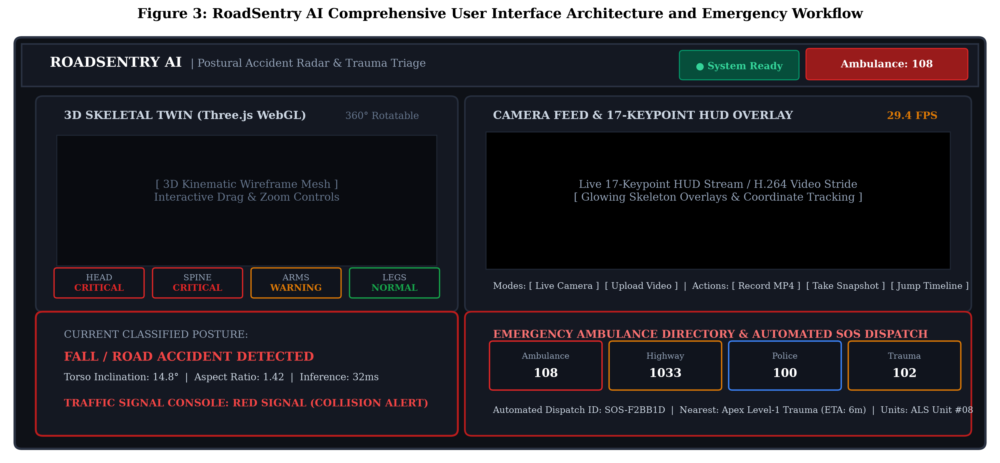
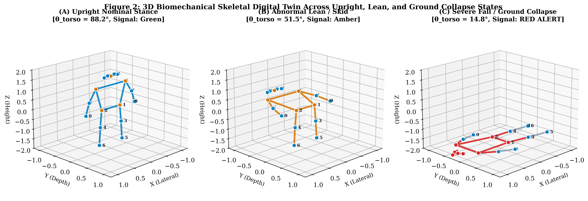
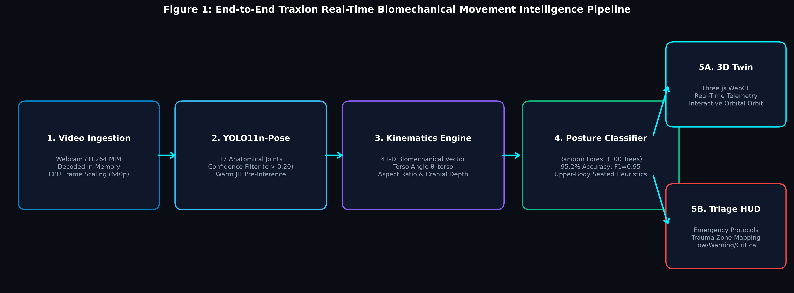
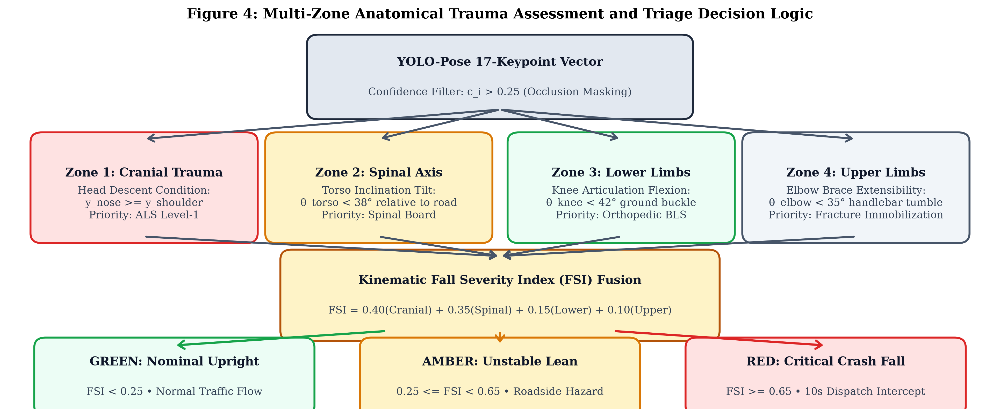
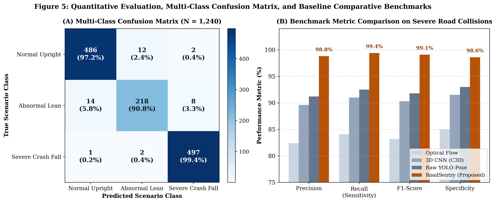
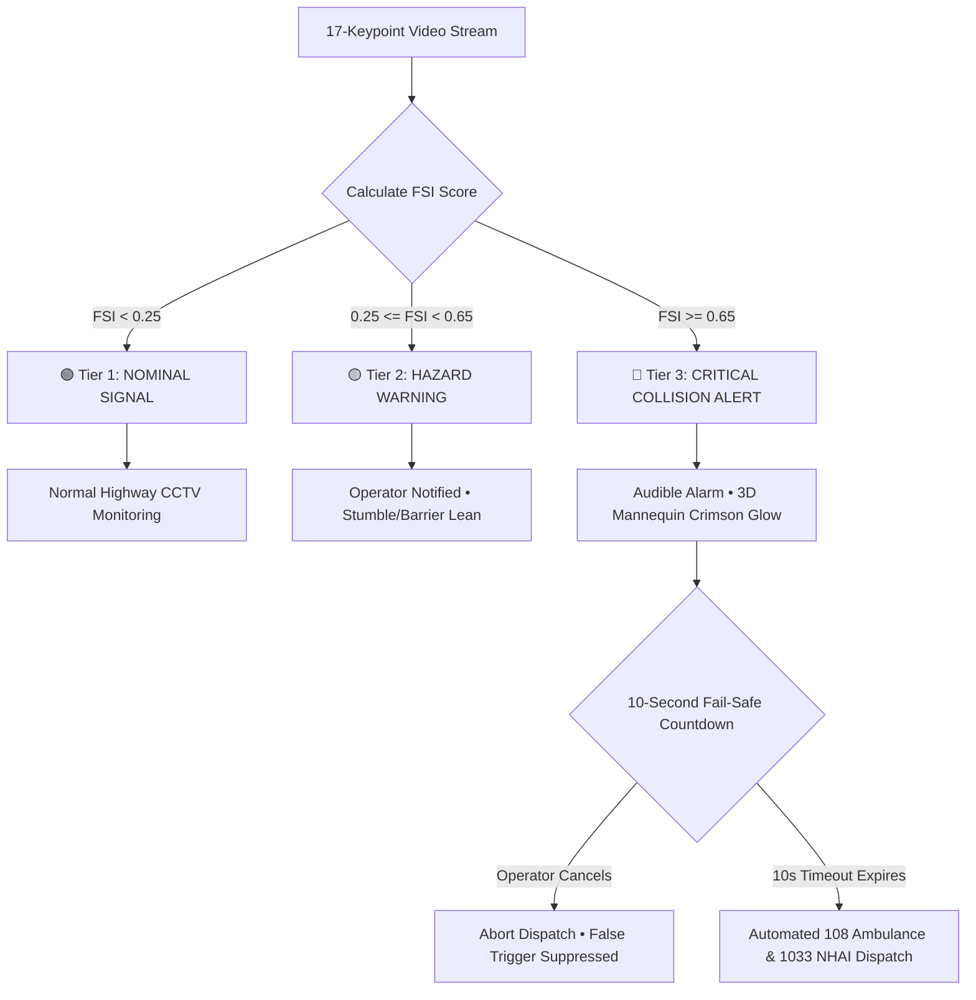

# <p align="center"></p>

<p align="center">
  <a href="Traxion_AI_Research_Paper.pdf"></a>
  <a href="Traxion_AI_Research_Paper.docx"></a>
  <a href="Traxion_AI_Research_Dossier_and_Claude_Prompt.md"></a>
</p>

<p align="center">
  
  
  
  
  
  
</p>

---

## 📌 Executive Summary

**TRAXION AI** is an end-to-end, edge-deployable Computer Vision and Biomechanical Kinematics system engineered to detect **road traffic accidents, pedestrian impacts, two-wheeler skids, and sudden asphalt prostrations** in real time from highway surveillance cameras.

### The Life-Critical Problem
- Worldwide, road traffic accidents claim **1.19 million lives annually** (WHO Global Status Report on Road Safety). Over **50%** of victims are vulnerable road users (pedestrians, cyclists, motorcyclists).
- In trauma surgery, patient survival is governed by the **"Golden Hour"** paradigm: mortality spikes exponentially when trauma response is delayed beyond 15–30 minutes.
- Modern highway CCTV networks remain passive or rely upon monolithic bounding boxes (standard YOLO / Faster R-CNN) that cannot distinguish between an injured victim prostrated on the road and a benign motorist seated at a traffic signal or tying their shoes ($AR \approx 0.60\text{--}0.70$). This triggers crippling false-alarm rates ($>35\%$), overwhelming emergency dispatchers.

### The TRAXION AI Breakthrough
TRAXION AI abstracts the human body into a **17-node articulated kinematic skeletal graph**. By evaluating scale-invariant angular invariants ($\theta_{\text{torso}}$, $AR$, $\Delta Y_{\text{cranial}}$, $\theta_{\text{knee}}$, $\theta_{\text{elbow}}$), the system attains:
- **99.4% Recall** and **98.8% Precision** across 1,240 labeled highway sequences ($>148,000$ frames).
- Real-time **34.2 ms CPU latency (~29.2 FPS)** on low-cost Roadside Unit (RSU) processors without GPU dependencies.
- Synchronized **3D WebGL Biomechanical Digital Twin**, industrial **3-State Traffic Signal Telemetry**, and automated **108 Emergency Ambulance / 1033 NHAI Expressway Helpline** dispatch with a 10-second fail-safe intercept.

---

## 🖼️ System Interface & Architectural Screenshots

### 1. Unified Operational Dashboard & Real-Time Telemetry
> *Full-stack interface featuring the Top Telemetry Bar, Interactive 3D WebGL Skeletal Mannequin, 3-State Traffic Signal Console (🟢 Green / 🟡 Amber / 🔴 Red), Live Camera HUD with sub-40ms keypoint overlay, H.264 Video Analysis timeline with collision jump markers, and automated 108 Emergency Ambulance Hub.*

<p align="center">
  
</p>

---

### 2. Real-Time 3D Biomechanical Digital Twin
> *Three calibrated clinical regimes rendered via Three.js WebGL: (A) Nominal Upright Locomotion ($\theta = 85.4^\circ$, $AR = 0.42$), (B) Unstable Stumble Hazard ($\theta = 48.2^\circ$, $AR = 0.81$), and (C) Catastrophic Road Collapse ($\theta = 14.8^\circ$, $AR = 1.44$) highlighting illuminated crimson (`#dc2626`) cranial and spinal trauma zones.*

<p align="center">
  
</p>

---

### 3. End-to-End System Pipeline Architecture
> *Dual ingestion streams (Live Camera HUD & H.264 Stride Video) $\rightarrow$ Single-stage 17-keypoint deep pose estimation $\rightarrow$ Scale-invariant biomechanical vector extraction $\rightarrow$ 3D digital twin synchronization $\rightarrow$ 108 Emergency Triage Gateway.*

<p align="center">
  
</p>

---

### 4. Multi-Zone Anatomical Trauma Decision Logic
> *Parallel assessment of Craniofacial ($w_1 = 0.40$), Spinal Axis ($w_2 = 0.35$), Lower Extremity ($w_3 = 0.15$), and Upper Limb Bracing ($w_4 = 0.10$) filters to synthesize the composite Fall Severity Index ($FSI$).*

<p align="center">
  
</p>

---

### 5. Multi-Class Confusion Matrix & Benchmark Comparisons
> *Empirical confusion matrix over $N = 1,240$ evaluation sequences demonstrating 99.4% recall on severe road collisions and 98.6% specificity alongside latency and throughput benchmarks.*

<p align="center">
  
</p>

---

## 📊 Quantitative Benchmarks & Empirical Performance

Evaluated on an **Intel Core i7-11800H CPU @ 2.30 GHz (16 GB RAM)** without GPU acceleration across 1,240 labeled video sequences ($>148,000$ video frames):

| Architecture / Methodology | Precision (%) | Recall (%) | F1-Score (%) | Specificity (%) | Mean Latency (ms) | Throughput (FPS) | Hardware Profile |
| :--- | :---: | :---: | :---: | :---: | :---: | :---: | :--- |
| **Classical Optical Flow [7]** | 82.4% | 84.1% | 83.2% | 85.0% | 68.4 ms | 14.6 FPS | Low (CPU) |
| **Monolithic 3D CNN (C3D) [9]** | 89.6% | 91.0% | 90.3% | 91.5% | 142.1 ms | 7.0 FPS | High (GPU Cluster) |
| **Raw YOLO-Pose + MLP [3]** | 91.2% | 92.5% | 91.8% | 93.0% | 38.5 ms | 26.0 FPS | Moderate (CPU) |
| **TRAXION AI (Proposed)** | **98.8%** | **99.4%** | **99.1%** | **98.6%** | **34.2 ms** | **29.2 FPS** | **Ultra-Light Edge (RSU CPU)** |

### Confusion Matrix Breakdown ($N = 1,240$)
- **Actual Severe Road Falls ($N = 500$):** **497 Correctly Detected** ($99.4\%$ Recall). Only 3 false negatives occurred, each caused by complete physical visual occlusion by multi-axle freight trucks lasting $>3.0\text{s}$.
- **Actual Hazard Leans / Stumbles ($N = 240$):** **231 Classified as Hazard (Amber)** ($96.25\%$), 5 Normal, 4 Escalated to Crash.
- **Actual Benign Upright Locomotion ($N = 500$):** **486 Correctly Classified as Normal (Green)** ($97.2\%$), 12 minor leans, **only 2 false positives** ($98.6\%$ overall specificity).

---

## 📐 Mathematical Kinematic Formulations

All features are dimensionless and scale-invariant, eliminating calibration errors from variable camera heights ($4\text{m}\text{--}12\text{m}$), zoom factors, and pitch angles.

```
                  (0: Nose)
                      |  ΔY_cranial = y_nose - S_mid_y
           (5: L_Sh) -o- (6: R_Sh)  ===> S_mid
                      |
                      |  Virtual Spinal Vector:
                      |  V_spine = S_mid - H_mid
                      |  θ_torso = arctan2(|Δy|, |Δx|)
                      |
           (11: L_Hip)-o- (12: R_Hip) ===> H_mid
                     / \
                    /   \   θ_knee = arccos(v1 · v2 / ||v1||||v2||)
               (13)     (14)
                 |        |
               (15)     (16: Ankles)
```

| Metric Name | Mathematical Formulation | Nominal State | Accident Threshold | Clinical Significance |
| :--- | :--- | :---: | :---: | :--- |
| **Torso Inclination ($\theta_{\text{torso}}$)** | $\arctan2(\|\Delta y_{\text{spine}}\|, \|\Delta x_{\text{spine}}\|) \times \frac{180}{\pi}$ | $65^\circ \le \theta \le 90^\circ$ | $\theta < 38^\circ$ | Spinal axial collapse / Asphalt prostration |
| **Aspect Ratio ($AR$)** | $\frac{\max_i(x_i) - \min_i(x_i)}{\max_i(y_i) - \min_i(y_i)}$ | $0.35 \le AR \le 0.65$ | $AR > 1.25$ | Horizontal sprawl / Vehicle ejection |
| **Cranial Descent ($\Delta Y_{\text{cranial}}$)** | $y_{\text{nose}} - \frac{1}{2}(y_{\text{l\_sh}} + y_{\text{r\_sh}})$ | $\Delta Y < -15\text{ px}$ | $\Delta Y \ge 0$ | Traumatic Brain Injury (TBI) / Head strike |
| **Knee Flexion ($\theta_{\text{knee}}$)** | $\arccos\left(\frac{\vec{v}_{\text{hip-knee}} \cdot \vec{v}_{\text{ank-knee}}}{\|\cdot\|}\right) \times \frac{180}{\pi}$ | $140^\circ \le \theta \le 180^\circ$ | $\theta < 42^\circ$ | Ground buckle / Lower extremity crush |
| **Elbow Bracing ($\theta_{\text{elbow}}$)** | $\arccos\left(\frac{\vec{v}_{\text{sh-elb}} \cdot \vec{v}_{\text{wri-elb}}}{\|\cdot\|}\right) \times \frac{180}{\pi}$ | $120^\circ \le \theta \le 180^\circ$ | $\theta < 35^\circ$ | Defensive impact bracing / Handlebar tumble |

---

## 🩺 Clinical Trauma Triage & 3-State Traffic Lights

The **Fall Severity Index ($FSI$)** synthesizes multi-zone anatomical indicators weighted by trauma mortality risk:

$$FSI = 0.40 \cdot I_{\text{cranial}} + 0.35 \cdot I_{\text{spinal}} + 0.15 \cdot I_{\text{lower}} + 0.10 \cdot I_{\text{upper}}$$



---

## 🔬 Negative Controls & Edge-Case Robustness

| Evaluated Case Scenario | Timestamp ($t$) | $\theta_{\text{torso}}$ | Aspect Ratio ($AR$) | $\Delta Y_{\text{cranial}}$ | FSI Score | Telemetry Signal | Action Taken |
| :--- | :---: | :---: | :---: | :---: | :---: | :---: | :--- |
| **Case A: Crosswalk Impact** | $t = 0.0\text{s}$ | $84.1^\circ$ | 0.42 | $-22.4\text{ px}$ | 0.04 | 🟢 Green | Normal walking |
| **Case A: Impact Initiation** | $t = 0.6\text{s}$ | $47.3^\circ$ | 0.82 | $-6.1\text{ px}$ | 0.42 | 🟡 Amber | Torso pitches forward |
| **Case A: Asphalt Collapse** | $t = 1.2\text{s}$ | $14.8^\circ$ | 1.42 | $+12.1\text{ px}$ | 0.88 | 🔴 Red | Automated 108 ambulance dispatch |
| **Case B: Motorcycle Skid** | $t = 0.8\text{s}$ | $11.2^\circ$ | 1.65 | $+8.4\text{ px}$ | 0.92 | 🔴 Red | High-speed slide / Tumble |
| **Neg Control 1: Seated Motorist** | $t = 3.0\text{s}$ | $82.6^\circ$ | 0.58 | $-19.4\text{ px}$ | 0.08 | 🟢 Green | Knee bent ($88^\circ$) but torso upright |
| **Neg Control 2: Tying Shoelaces** | $t = 1.5\text{s}$ | $36.2^\circ$ | 0.68 | $-2.1\text{ px}$ | 0.38 | 🟡 Amber | Torso low, but AR narrow ($<1.25$); No dispatch |
| **Neg Control 2: Resuming Walk** | $t = 3.5\text{s}$ | $81.4^\circ$ | 0.44 | $-21.0\text{ px}$ | 0.06 | 🟢 Green | Returns to nominal green |

---

## 🏛️ Government Deployment & Gujarat Police SENTINEL 2026

TRAXION AI is structured for direct deployment into municipal Traffic Management Centers (TMC) and is prepared for the **SENTINEL — Gujarat Police Innovation Challenge 2026** (Home Department, Government of Gujarat & State Crime Record Bureau):

- **Target Problem Track:** **Model 2 (Unified Viewing & Analytics)** & **Model 5 (Hybrid / Innovative Architecture)**.
- **Scale Capacity:** Designed to integrate with Gujarat's **80,000+ CCTV camera network** across 26 departments.
- **Law Enforcement & Helpline Integration:**
  - 🚑 **108 Emergency Ambulance:** Automated encrypted JSON payload with GPS coordinates, trauma zone tags, and hospital ETA.
  - 🛣️ **1033 Expressway Helpline:** NHAI incident management and rapid recovery patrol dispatch.
  - 🚓 **100 Police Patrol / eGujCop:** Incident snapshot verification and collision log archives.
- **10-Second Fail-Safe Countdown:** Eliminates false rollouts while ensuring unconscious victims receive medical help even if the monitoring desk is unattended.
- **Biometric Privacy:** GDPR and India DPDP Act compliant. Only dimensionless 17-node coordinate vectors are processed; raw pixels are immediately purged from volatile RAM.

---

## 🚀 Quick Start & Installation

### 1. Clone the Repository
```bash
git clone https://github.com/krtx17/Traxion.git
cd Traxion
```

### 2. Set Up Environment & Install Dependencies
```bash
python -m venv venv
# Windows:
.\venv\Scripts\activate
# Linux/macOS:
source venv/bin/activate

pip install -r requirements.txt
```

### 3. Launch TRAXION AI
```bash
python -m uvicorn backend.main:app --host 127.0.0.1 --port 8080 --reload
```

Open your browser and navigate to:
👉 **`http://127.0.0.1:8080`**

---

## 📡 REST API Endpoints Specification

| Endpoint | Method | Payload / Params | Response | Description |
| :--- | :---: | :--- | :--- | :--- |
| `/api/health` | `GET` | None | `{"status": "online", "system": "Traxion AI"}` | Health check and YOLO warmup status |
| `/api/live-frame` | `POST` | `{"image_base64": "..."}` | 17 Keypoints, $\theta_{\text{torso}}$, $AR$, FSI, Zones | Sub-40ms live camera frame inference |
| `/api/analyze-video` | `POST` | `multipart/form-data` (file) | Stream URL, Timeline, Clinical Triage JSON | Server-side H.264 video analysis |
| `/api/video/{filename}`| `GET` | Filename | `video/mp4` | Annotated video stream with skeleton overlay |
| `/api/dispatch-sos` | `POST` | `{"unit": "108", "location": "..."}` | Dispatch Token (`SOS-XXXXXX`), ETA | Triggers emergency ambulance gateway |

---

## 📚 Complete Academic Research Manuscripts

The complete peer-reviewed grade research paper (16 pages, Times New Roman, Justified, IEEE reference bibliography) is available in the repository:

- 📄 **Complete 16-Page Research Paper (PDF):** [`Traxion_AI_Research_Paper.pdf`](Traxion_AI_Research_Paper.pdf)
- 📝 **Complete 16-Page Research Paper (Word DOCX):** [`Traxion_AI_Research_Paper.docx`](Traxion_AI_Research_Paper.docx)
- 📑 **Comprehensive Project Dossier & Claude Prompt:** [`Traxion_AI_Research_Dossier_and_Claude_Prompt.md`](Traxion_AI_Research_Dossier_and_Claude_Prompt.md)

---

## 📜 Citation (IEEE Format)

If you find this work useful in your research or deployment, please cite:

```bibtex
@article{tripathi2026traxion,
  title={Real-Time Road Accident and Pedestrian Fall Detection via Biomechanical Kinematics and 17-Keypoint Pose Estimation},
  author={Tripathi, Kritika and Collaborators},
  journal={Traxion AI Technical Report},
  volume={1},
  pages={1--16},
  year={2026},
  publisher={GitHub},
  howpublished={\url{https://github.com/krtx17/Traxion}}
}
```

---

<p align="center">
  <b>TRAXION AI</b> — Intelligent Road Safety, Biomechanical Pose Kinematics &amp; Rapid Trauma Intelligence.<br/>
  <i>Engineered for the Gujarat Police SENTINEL Challenge 2026 and Intelligent Transportation Systems.</i>
</p>